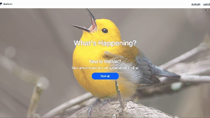

# Warbler

Warbler is a Twitter clone for bird lovers, so tweet your thoughts, chirp your feelings, and warble your heart out!

It is a full-stack web application built with Flask, Python, Jinja, WTForms, PostgresSQL and SQLAlchemy. Warbler is engineered with encryption and password hashing, user authentication and authorization, RESTful routing, as well as thoughtful database designs and models.

## [Live Demo Link](https://warbler-zqd5.onrender.com/)

## Features

- Users can sign up for an account, log in and edit their profile (including updating profile picture)
- Users can create posts, referred to as "warbles"
- Users can like and unlike warbles
- Users can view a list of warbles they have liked
- Users can follow other users and see who is following them
- Users can view a news feed, containing warbles of users that they follow
- Users can view a list of their own posted warble
- Users can delete their own warbles
- Users can search for a specific user or post, using keywords

## Getting Started

To get started with Warbler, follow the steps below:

1. Clone the repository to your local machine.
2. Create Python virtual environment: python -m venv venv
3. Activate virtual environment: source venv/bin/activate
4. Install dependencies with pip install -r requirements.txt
5. Create database: createdb warbler
6. Seed database: python seed.py
7. Start server: flask run
8. Open http://localhost:5000/ to view project in the browser

## Testing

Tests are run using unittest. To run the tests, follow the steps below:

1. Open a terminal.
2. Run `FLASK_DEBUG=False python -m unittest` to execute the tests.

## Tech Stack

- Jinja/WTForms for frontend
- Flask/Python for backend
- PostgreSQL for database
- SQLAlchemy for database ORM

## Dependencies

- Flask
- Python
- PostgreSQL
- SQLAlchemy
- Jinja
- WTForms
- Bcrypt
- Gunicorn
- jQuery
- Bootstrap

## Authors

- Gracee Gallivan
- JiHye Yoon (pair programming partner)
